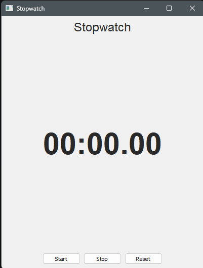

# Stopwatch GUI

A simple desktop stopwatch built with Python and PyQt5 — my first GUI project, built to learn event-driven programming, Qt's signal/slot system, and layout management.



## Features

- Start, stop, and reset controls
- Live time display in `MM:SS.cs` format (centisecond precision)
- Clean, centered layout built with `QVBoxLayout` and `QHBoxLayout`

## How it works

A `QTimer` fires every 10ms to recalculate and redisplay the elapsed time. Rather than just counting timer ticks, elapsed time is derived from `time.time()`, so the display stays accurate even if the UI thread is briefly delayed. Stopping and restarting accumulates time correctly by tracking `start_time` and `elapsed_time` separately, rather than resetting on every stop.

## Requirements

- Python 3.8+
- PyQt5

Install the dependency:

```bash
pip install PyQt5
```

## Usage

```bash
python "Stopwatch GUI.py"
```

## What I learned

This was my first PyQt5 project, and it's where I picked up:

- The Qt event loop and `QTimer`
- Connecting signals to slots (e.g. `clicked.connect(...)`)
- Structuring a `QMainWindow` around a central widget with nested layouts

## Possible improvements

- Lap/split tracking
- Saving session times to a file
- Keyboard shortcuts (space to start/stop, R to reset)


